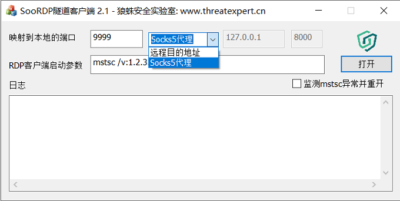
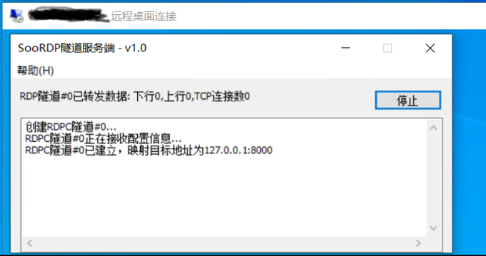

# SooRDP

## 简介

&nbsp;&nbsp;&nbsp;&nbsp;&nbsp;&nbsp;
SooRDP是Windows远程桌面连接的一个插件，基于远程桌面的会话提供用户一个TCP隧道接口的小工具。

&nbsp;&nbsp;&nbsp;&nbsp;&nbsp;&nbsp;
由于Windows服务器的主要远程管理方式是3389端口的RDP协议，但RDP协议相比Linux系统的SSH协议却缺少了一个技术人员常用的功能，即SSH客户端的-D或-L参数可提供用户基于SSH隧道的端口转发功能。

&nbsp;&nbsp;&nbsp;&nbsp;&nbsp;&nbsp;
SooRDP名字的意思是Socks Over RDP，这个插件就是为Windows的远程桌面客户端增加了SSH的-D或-L参数的功能。

## 功能介绍

&nbsp;&nbsp;&nbsp;&nbsp;&nbsp;&nbsp;
SooRDP插件功能有两种模式，一种是纯TCP端口转发，另一种是本地提供Socks5协议端口。

&nbsp;&nbsp;&nbsp;&nbsp;&nbsp;&nbsp;
如果常用SSH端口转发的技术人员应该很熟悉-L或-D参数的功能了，-L参数就是纯端口转发，需要用户指定本地监听端口和通过ssh隧道转发的目的地址，即要求ssh客户端本地监听一个TCP端口，把接入的连接从ssh隧道转发到目的地址。-D参数则不需要指定转发的目的地址，因为ssh客户端本地监听的端口是一个socks代理服务，目的地址可以动态协商。

## 主要特点

 * SooRDP为了方便用户使用，提供了界面操作，客户端程序打开时自动注册DLL插件，退出时卸载插件。
 * SooRDP支持Windows 2003至今，在全网似乎找不到能支持Server 2008之前的此类工具，SooRDP会根据系统自适应Static或Dynamic Virtual Channel接口，因为Server 2008之前远程桌面只有Static接口（用该接口针对实现端口转发功能难度很大）。

## License

[MIT](./LICENSE) © threatexpert.cn
